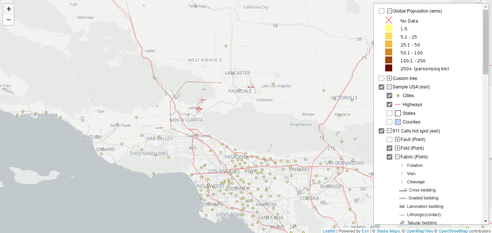

# L.LayerTreeControl

A leaflet plugin to group multiple types of layers in a tree structure.



## Demo

  - <https://github.com/ignaciofagian/L.LayerTreeControl/>

## Usage Example

```javascript
var esriSampleUsa = L.esri.dynamicMapLayer({
  url: 'https://sampleserver6.arcgisonline.com/arcgis/rest/services/USA/MapServer',
  opacity: 0.7,
  layers: [],
});

var wmsGlobalPopulation = L.tileLayer.wms('https://sedac.ciesin.columbia.edu/geoserver/wms?', {
  layers: 'gpw-v3:gpw-v3-population-density_2000',
  transparent: true,
  format: 'image/png',
});

// define tree structure
var layers = [
  {
    layer: esriSampleUsa,
    name: 'Sample USA (esri)',
    type: 'esriDynamic',
  },		
  {
    type: 'leaflet',
    name: 'Custom tree',
    children: [
      {
        name: 'Level 1',
        children: [
          {
            name: 'Global Population',
            layer: wmsGlobalPopulation,
          },
        ],
      },
    ],
  },
];

var layerTreeCtrl = new L.Control.LayerTreeControl(layers, {
  position: 'topright',
});

map.addControl(layerTreeCtrl);
```